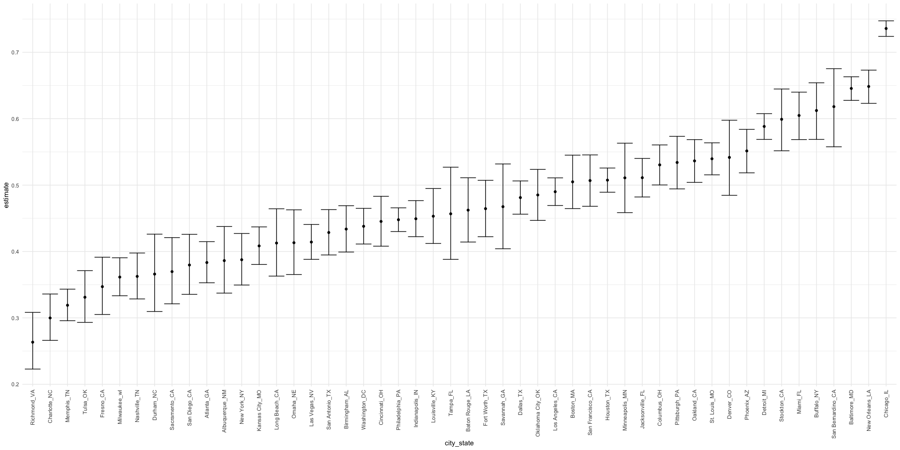
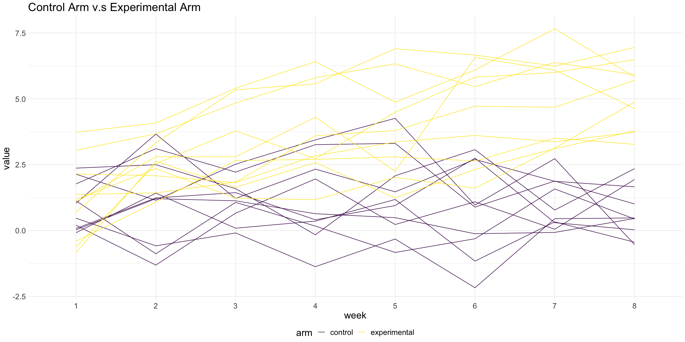

P8105 Homework5
================
Xiangyi Liu (xl3048)
11/10/2020

## Problem 1

Read in the data.

``` r
homicide_df = 
  read_csv("./data/homicide-data.csv") %>% 
  mutate(
    city_state = str_c(city, state, sep = "_"),
    resolved = case_when(
      disposition == "Closed without arrest" ~ "unsolved",
      disposition == "Open/No arrest"        ~ "unsolved",
      disposition == "Closed by arrest"      ~ "solved",
    )
  ) %>% 
  select(city_state, resolved) %>% 
  filter(city_state != "Tulsa_AL")
```

    ## Parsed with column specification:
    ## cols(
    ##   uid = col_character(),
    ##   reported_date = col_double(),
    ##   victim_last = col_character(),
    ##   victim_first = col_character(),
    ##   victim_race = col_character(),
    ##   victim_age = col_character(),
    ##   victim_sex = col_character(),
    ##   city = col_character(),
    ##   state = col_character(),
    ##   lat = col_double(),
    ##   lon = col_double(),
    ##   disposition = col_character()
    ## )

Let’s look at this a bit

``` r
aggregate_df = 
  homicide_df %>% 
  group_by(city_state) %>% 
  summarize(
    hom_total = n(),
    hom_unsolved = sum(resolved == "unsolved")
  )
```

    ## `summarise()` ungrouping output (override with `.groups` argument)

Can I do a prop test for a single city?

``` r
prop.test(
  aggregate_df %>% filter(city_state == "Baltimore_MD") %>% pull(hom_unsolved), 
  aggregate_df %>% filter(city_state == "Baltimore_MD") %>% pull(hom_total)) %>% 
  broom::tidy()
```

    ## # A tibble: 1 x 8
    ##   estimate statistic  p.value parameter conf.low conf.high method    alternative
    ##      <dbl>     <dbl>    <dbl>     <int>    <dbl>     <dbl> <chr>     <chr>      
    ## 1    0.646      239. 6.46e-54         1    0.628     0.663 1-sample… two.sided

Try to iterate ……..

``` r
results_df = 
  aggregate_df %>% 
  mutate(
    prop_tests = map2(.x = hom_unsolved, .y = hom_total, ~prop.test(x = .x, n = .y)),
    tidy_tests = map(.x = prop_tests, ~broom::tidy(.x))
  ) %>% 
  select(-prop_tests) %>% 
  unnest(tidy_tests) %>% 
  select(city_state, estimate, conf.low, conf.high)
```

``` r
results_df %>% 
  mutate(city_state = fct_reorder(city_state, estimate)) %>% 
  ggplot(aes(x = city_state, y = estimate)) +
  geom_point() + 
  geom_errorbar(aes(ymin = conf.low, ymax = conf.high)) + 
  theme(axis.text.x = element_text(angle = 90, vjust = 0.5, hjust = 1))
```



## Problem 2

``` r
path_df = 
  tibble(
    path = list.files("./data/data"),
  ) %>%
  mutate(
    path = str_c("./data/data/",path),
    data = map(.x=path, ~ read.csv(.x)),
    file = list.files("./data/data")
  ) %>%
  select(-path) %>%
  relocate(file,data) %>%
  unnest(data) %>%
  separate(file,sep = "_", into = c("arm","ID")) %>%
  mutate(
    arm = case_when(
      arm == "con" ~ "control",
      arm == "exp" ~ "experimental"
    )
  ) %>%
  unite(arm_id,arm,ID,sep = "_")
path_df$arm_id<-gsub("\\..*","",path_df$arm_id)

write.csv(path_df,file = "./data/prob2_path_df.csv")

head(path_df)
```

    ## # A tibble: 6 x 9
    ##   arm_id     week_1 week_2 week_3 week_4 week_5 week_6 week_7 week_8
    ##   <chr>       <dbl>  <dbl>  <dbl>  <dbl>  <dbl>  <dbl>  <dbl>  <dbl>
    ## 1 control_01   0.2  -1.31    0.66   1.96   0.23   1.09   0.05   1.94
    ## 2 control_02   1.13 -0.88    1.07   0.17  -0.83  -0.31   1.58   0.44
    ## 3 control_03   1.77  3.11    2.22   3.26   3.31   0.89   1.88   1.01
    ## 4 control_04   1.04  3.66    1.22   2.33   1.47   2.7    1.87   1.66
    ## 5 control_05   0.47 -0.580  -0.09  -1.37  -0.32  -2.17   0.45   0.48
    ## 6 control_06   2.37  2.5     1.59  -0.16   2.08   3.07   0.78   2.35

``` r
path_longer_df<-path_df %>% 
  pivot_longer(
    week_1:week_8,
    names_to = "week",
    names_prefix = "week_",
    values_to = "value"
  ) %>%
  separate(arm_id,sep = "_",into = c("arm","id")) %>%
  unite(arm_id,arm,id,sep = "_",remove = F) %>%
  select(-id)


p<-ggplot(data = path_longer_df, aes(x = week, y = value, group = arm_id, color = arm))+
  geom_line()
p
```



At Week 1, two groups did not appear a significant difference. Only two
participants from the experimental group had noteworthy higher
measurements compared to the control group.  
During the course of the study, the difference between the two groups
became gradually obvious. The measurements taken from the control group
roughly remained at the same level from Week 1 to Week 8. However, the
measurements taken from the experimental group increased steadily every
week. At Week 8, all participants in the experimental group had a higher
measurements than that of the control group.

## Problem 3

``` r
set.seed(1)

sim_mean_sd = function(samp_size=30, mu, sigma = 3) {

  sim_data = list(
    x=rnorm(n=samp_size, mean = mu, sd = sigma)
  ) %>% bind_rows()
  
  }

sim_data<-rerun(5,sim_mean_sd(mu=0))


result<- tibble(
  t_test = map(.x=sim_data,~t.test(.x))
 ) %>%
  mutate(
   tidy_tests = map(.x = t_test, ~broom::tidy(.x))
 ) %>%
select(-t_test) %>%
unnest(tidy_tests) %>%
select(estimate,p.value) %>%
rename(mu_hat = estimate)

result %>% knitr::kable(digits = 3)
```

| mu\_hat | p.value |
| ------: | ------: |
|   0.247 |   0.629 |
|   0.398 |   0.368 |
|   0.331 |   0.534 |
|   0.340 |   0.487 |
| \-0.990 |   0.060 |
