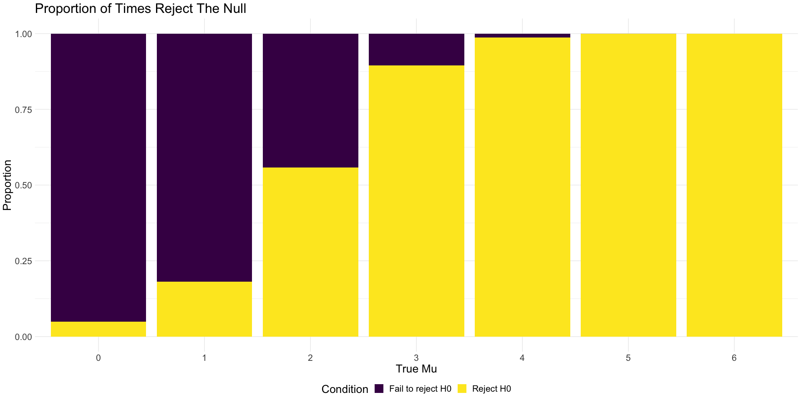
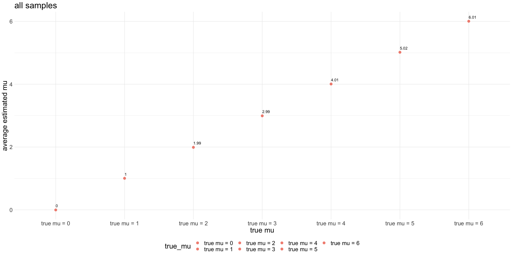
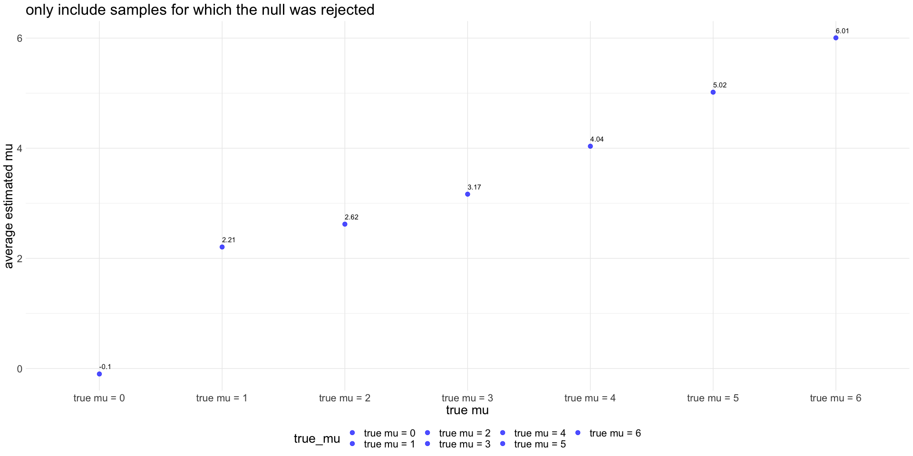

P8105 Homework5
================
Xiangyi Liu (xl3048)
11/10/2020

## Problem 1

Read in the data.

``` r
homicide_df = 
  read_csv("./data/homicide-data.csv") %>% 
  mutate(
    city_state = str_c(city, state, sep = "_"),
    resolved = case_when(
      disposition == "Closed without arrest" ~ "unsolved",
      disposition == "Open/No arrest"        ~ "unsolved",
      disposition == "Closed by arrest"      ~ "solved",
    )
  ) %>% 
  select(city_state, resolved) %>% 
  filter(city_state != "Tulsa_AL")
```

    ## Parsed with column specification:
    ## cols(
    ##   uid = col_character(),
    ##   reported_date = col_double(),
    ##   victim_last = col_character(),
    ##   victim_first = col_character(),
    ##   victim_race = col_character(),
    ##   victim_age = col_character(),
    ##   victim_sex = col_character(),
    ##   city = col_character(),
    ##   state = col_character(),
    ##   lat = col_double(),
    ##   lon = col_double(),
    ##   disposition = col_character()
    ## )

Let’s look at this a bit

``` r
aggregate_df = 
  homicide_df %>% 
  group_by(city_state) %>% 
  summarize(
    hom_total = n(),
    hom_unsolved = sum(resolved == "unsolved")
  )
```

    ## `summarise()` ungrouping output (override with `.groups` argument)

Can I do a prop test for a single city?

``` r
prop.test(
  aggregate_df %>% filter(city_state == "Baltimore_MD") %>% pull(hom_unsolved), 
  aggregate_df %>% filter(city_state == "Baltimore_MD") %>% pull(hom_total)) %>% 
  broom::tidy()
```

    ## # A tibble: 1 x 8
    ##   estimate statistic  p.value parameter conf.low conf.high method    alternative
    ##      <dbl>     <dbl>    <dbl>     <int>    <dbl>     <dbl> <chr>     <chr>      
    ## 1    0.646      239. 6.46e-54         1    0.628     0.663 1-sample… two.sided

Try to iterate ……..

``` r
results_df = 
  aggregate_df %>% 
  mutate(
    prop_tests = map2(.x = hom_unsolved, .y = hom_total, ~prop.test(x = .x, n = .y)),
    tidy_tests = map(.x = prop_tests, ~broom::tidy(.x))
  ) %>% 
  select(-prop_tests) %>% 
  unnest(tidy_tests) %>% 
  select(city_state, estimate, conf.low, conf.high)
```

``` r
results_df %>% 
  mutate(city_state = fct_reorder(city_state, estimate)) %>% 
  ggplot(aes(x = city_state, y = estimate)) +
  geom_point() + 
  geom_errorbar(aes(ymin = conf.low, ymax = conf.high)) + 
  theme(axis.text.x = element_text(angle = 90, vjust = 0.5, hjust = 1))
```

<!-- -->

## Problem 2

``` r
path_df = 
  tibble(
    path = list.files("./data/data"),
  ) %>%
  mutate(
    path = str_c("./data/data/",path),
    data = map(.x=path, ~ read.csv(.x)),
    file = list.files("./data/data")
  ) %>%
  select(-path) %>%
  relocate(file,data) %>%
  unnest(data) %>%
  separate(file,sep = "_", into = c("arm","ID")) %>%
  mutate(
    arm = case_when(
      arm == "con" ~ "control",
      arm == "exp" ~ "experimental"
    )
  ) %>%
  unite(arm_id,arm,ID,sep = "_")
path_df$arm_id<-gsub("\\..*","",path_df$arm_id)

write.csv(path_df,file = "./data/prob2_path_df.csv")

head(path_df)
```

    ## # A tibble: 6 x 9
    ##   arm_id     week_1 week_2 week_3 week_4 week_5 week_6 week_7 week_8
    ##   <chr>       <dbl>  <dbl>  <dbl>  <dbl>  <dbl>  <dbl>  <dbl>  <dbl>
    ## 1 control_01   0.2  -1.31    0.66   1.96   0.23   1.09   0.05   1.94
    ## 2 control_02   1.13 -0.88    1.07   0.17  -0.83  -0.31   1.58   0.44
    ## 3 control_03   1.77  3.11    2.22   3.26   3.31   0.89   1.88   1.01
    ## 4 control_04   1.04  3.66    1.22   2.33   1.47   2.7    1.87   1.66
    ## 5 control_05   0.47 -0.580  -0.09  -1.37  -0.32  -2.17   0.45   0.48
    ## 6 control_06   2.37  2.5     1.59  -0.16   2.08   3.07   0.78   2.35

``` r
path_longer_df<-path_df %>% 
  pivot_longer(
    week_1:week_8,
    names_to = "week",
    names_prefix = "week_",
    values_to = "value"
  ) %>%
  separate(arm_id,sep = "_",into = c("arm","id")) %>%
  unite(arm_id,arm,id,sep = "_",remove = F) %>%
  select(-id)


p<-ggplot(data = path_longer_df, aes(x = week, y = value, group = arm_id, color = arm))+
  geom_line()+
  theme(text = element_text(size=20))+
  labs(title = "Control Arm v.s Experimental Arm")
p
```

<!-- -->

At Week 1, two groups did not appear a significant difference. Only two
participants from the experimental group had noteworthy higher
measurements compared to the control group.  
During the course of the study, the difference between the two groups
became gradually obvious. The measurements taken from the control group
roughly remained at the same level from Week 1 to Week 8. However, the
measurements taken from the experimental group increased steadily every
week. At Week 8, all participants in the experimental group had a higher
measurements than that of the control group.

## Problem 3

``` r
set.seed(1)

trial_num = 5000
sim_mean_sd = function(samp_size=30, mu, sigma = 5) {

  sim_data = list(
    x=rnorm(n=samp_size, mean = mu, sd = sigma)
  ) %>% bind_rows()
  
}

sim_data <- rerun(trial_num,sim_mean_sd(mu=0))


result <- tibble(
  t_test = map(.x=sim_data,~t.test(.x))
 ) %>%
  mutate(
   tidy_tests = map(.x = t_test, ~broom::tidy(.x))
 ) %>%
select(-t_test) %>%
unnest(tidy_tests) %>%
select(estimate,p.value) %>%
rename(mu_hat = estimate)

head(result) %>% knitr::kable(digits = 3)
```

| mu\_hat | p.value |
| ------: | ------: |
|   0.412 |   0.629 |
|   0.664 |   0.368 |
|   0.551 |   0.534 |
|   0.567 |   0.487 |
| \-1.650 |   0.060 |
|   1.185 |   0.229 |

``` r
mu_list = 
  list(
    "mu_0"  = 0,
    "mu_1"  = 1, 
    "mu_2"  = 2, 
    "mu_3" = 3, 
    "mu_4" = 4,
    "mu_5" = 5,
    "mu_6" = 6)


output_data = 
  tibble(mu_list = c(0,1,2,3,4,5,6)) %>% 
  mutate(
    output_lists = map(.x = mu_list, ~rerun(trial_num, sim_mean_sd(mu = .x)))
  ) %>%
  unnest(output_lists)

output_result<-tibble(
  t_test = map(.x=output_data$output_lists, ~t.test(.x,mu = 0))
) %>%
  mutate(
   tidy_tests = map(.x = t_test, ~broom::tidy(.x))
 )%>%
select(-t_test) %>%
unnest(tidy_tests) %>%
cbind(output_data$mu_list) %>%
rename(true_mu = `output_data$mu_list`) %>%
select(true_mu, estimate,p.value) %>%
relocate(true_mu, estimate,p.value)
```

``` r
reject_null_prop <- output_result %>%
  group_by(true_mu) %>%
  summarize(
    reject_null = sum(p.value<0.05)/n()
  ) %>%
  mutate(true_mu=as.factor(true_mu),
         fail_reject_null = 1-reject_null) 
```

    ## `summarise()` ungrouping output (override with `.groups` argument)

``` r
plot_reject_null_prop <-reject_null_prop %>%
  pivot_longer(
    reject_null:fail_reject_null,
    names_to = "condition",
    values_to = "proportion"
  )

p1<-ggplot(data = plot_reject_null_prop, aes(fill = condition, y = proportion, x = true_mu))+
  geom_bar(position="stack", stat="identity")+labs(title = "Proportion of Times Reject The Null", x = "True Mu", y = "Proportion", fill = "Condition")+scale_fill_discrete(labels = c("Fail to reject H0", "Reject H0"))+
  theme(text = element_text(size=20))
p1
```

<!-- -->

``` r
reject_null_prop%>% knitr::kable(digits = 3)
```

| true\_mu | reject\_null | fail\_reject\_null |
| :------- | -----------: | -----------------: |
| 0        |        0.050 |              0.950 |
| 1        |        0.181 |              0.819 |
| 2        |        0.557 |              0.443 |
| 3        |        0.894 |              0.106 |
| 4        |        0.987 |              0.013 |
| 5        |        1.000 |              0.000 |
| 6        |        1.000 |              0.000 |

The effect size, d, is defined as the number of standard deviations
between the null mean and the alternate mean, d = (μ1 - μ0)/σ  
  
μ0is the population mean for the null distribution, which is 0 in the
case.  
  
We also know that the mean for alternative distributions (μ1) for each
trial is 0, 1, 2,…,6 respectively. As mu1 increases, the difference
between μ1 and μ0 increases, the effect size d increases (σ = 5 does not
change).  
  
From the plot above, we can see that as the effect size gets larger, the
power, which is represented as the yellow proportion, gets larger.

``` r
output_result %>%
  group_by(true_mu) %>% 
  summarize(avg_estimate_mu = sum(estimate)/n()) %>% 
  mutate(
    true_mu = str_c("true mu = ",true_mu)
  ) %>% 
  ggplot(aes(x = true_mu, y = avg_estimate_mu, fill = true_mu))+
  geom_point(size=3,alpha=0.7,color = "tomato2")+
  labs(title = "all samples",x="true mu",y="average estimated mu")+
  geom_text(aes(label=round(avg_estimate_mu,2)),hjust=0, vjust=-1)+
  theme(text = element_text(size=20))
```

    ## `summarise()` ungrouping output (override with `.groups` argument)

<!-- -->

``` r
output_result %>%
  filter(p.value<0.05) %>%
  group_by(true_mu) %>% 
  summarize(avg_estimate_mu = sum(estimate)/n()) %>%
  mutate(
    true_mu = str_c("true mu = ",true_mu)
  ) %>% 
  ggplot(aes(x = true_mu, y = avg_estimate_mu, fill = true_mu))+
  geom_point(size=3,alpha=0.7,color = "blue")+
  labs(title = "only include samples for which the null was rejected",x="true mu",y="average estimated mu")+
  geom_text(aes(label=round(avg_estimate_mu,2)),hjust=0, vjust=-1)+
  theme(text = element_text(size=20))
```

    ## `summarise()` ungrouping output (override with `.groups` argument)

<!-- -->  
The sample average of μ̂ across tests for which the null is rejected
approximately equal to the true value of μ.  
As the true μ departs from 0, the average of μ̂ becomes closer and
closer to the true μ. This is because as the true μ departs from 0, the
proportion of samples that reject H0 gets larger (effect size increases,
the power of the test increases). Thus, the average of the samples that
reject H0 becomes closer to the true μ.
